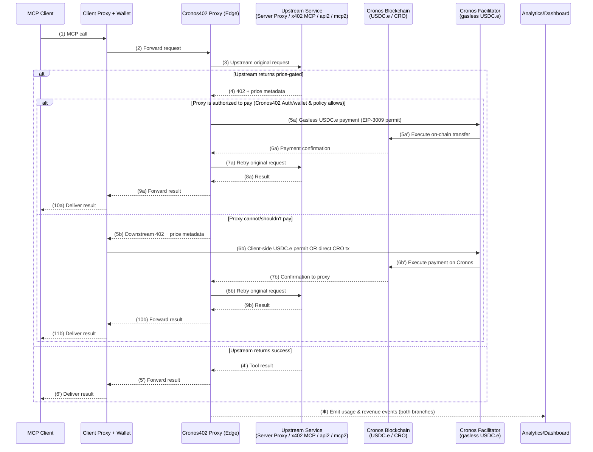

[Website](https://cronos402.dev) · [Discover](https://cronos402.dev/servers) · [Register](https://cronos402.dev/register)

---

## What is Cronos402?

Cronos402 is the **first MCP payment gateway built exclusively for Cronos blockchain**. It adds **on-chain payments** to any [Model Context Protocol (MCP)](https://modelcontextprotocol.io) server using the [x402 "Payment Required" protocol](https://x402.org).

It enables MCP clients — such as Claude Desktop, Cursor, and others — to make **pay-per-call requests** using **USDC.e** (gasless via Cronos facilitator) or **native CRO** instead of relying on static subscriptions or API keys.

The goal is to let AI agents and applications pay only for what they use on Cronos, automatically and transparently.

---

## Why Cronos402 (in 30 seconds)

* **Clients** → Pay only for what they use with **USDC.e** (gasless) or **CRO** — no subscriptions, no keys, no setup. Works out of the box with MCP-compatible apps (Claude Desktop, Cursor, and more).
* **Developers** → Monetize your MCP servers on Cronos using our SDK. Set per-call USD pricing and receive payments in USDC.e or CRO automatically via the Cronos facilitator.
* **Agents** → Perform real **agent↔service micropayments** on Cronos, enabling autonomous access to APIs, inference, data, and more with native Cronos token support.

---

## How it works

Cronos402 handles the entire payment lifecycle transparently on Cronos blockchain for both developers and clients:

- Follows x402 protocol with structured price metadata
- Supports **USDC.e gasless payments** via Cronos facilitator (EIP-3009 transferWithAuthorization)
- Supports **native CRO direct payments** where users control gas
- Verifies payments on-chain, then automatically retries the original MCP request once confirmed
- Streams usage and revenue events to dashboards and analytics endpoints

This mechanism ensures that any MCP-compatible app or agent can pay per call on Cronos — either with gasless USDC.e or direct CRO transactions.

In practice, this means any MCP server can become a paid endpoint on Cronos with zero friction.

The Cronos402 proxy acts as the coordination layer between **clients, wallets, and upstream services** — automatically handling `402` negotiation, Cronos on-chain payments (USDC.e gasless or CRO direct), and retries.

Once a payment is confirmed via the Cronos facilitator or blockchain, the same request is retried transparently, and the result is streamed back to the client along with usage and revenue data.
