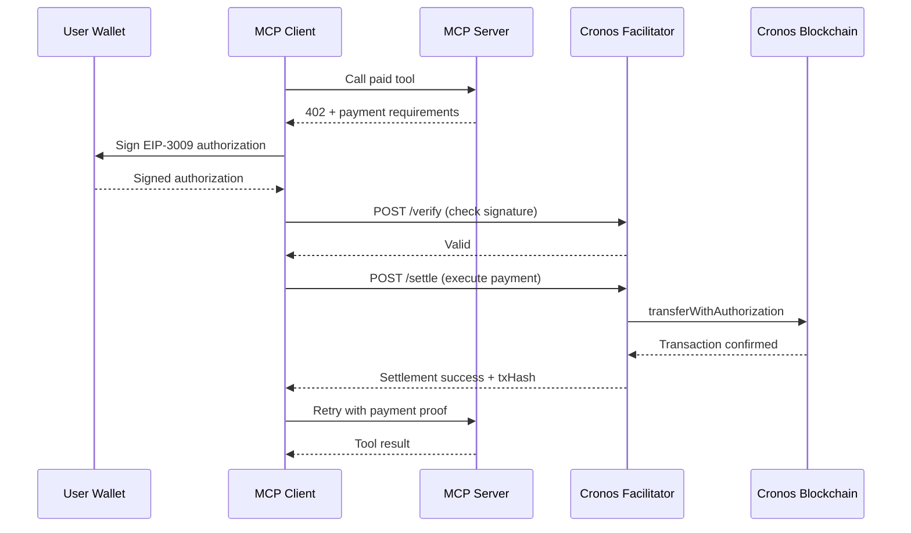
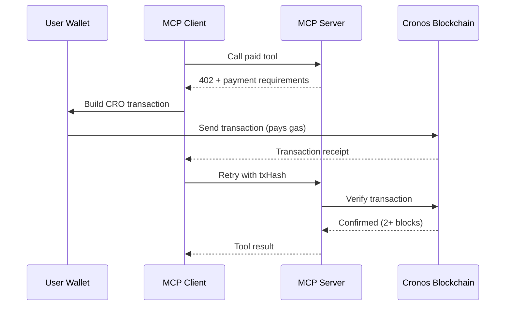

Cronos402 supports two payment methods on the Cronos blockchain:

1. **USDC.e** - Gasless payments via the Cronos facilitator (EIP-3009)
2. **CRO** - Direct native token payments (user pays gas)

## USDC.e Gasless Payments

USDC.e payments use EIP-3009 `transferWithAuthorization`, allowing users to pay without holding CRO for gas. The Cronos facilitator covers gas costs.

### How It Works



### EIP-3009 Authorization

The user signs a transfer authorization that includes:

| Field | Description |
|-------|-------------|
| `from` | Payer address |
| `to` | Recipient address |
| `value` | Amount in USDC.e (6 decimals) |
| `validAfter` | Earliest valid timestamp |
| `validBefore` | Latest valid timestamp |
| `nonce` | Unique nonce (timestamp + random) |

### EIP-712 Domain

```typescript
const domain = {
  name: "Bridged USDC (Stargate)",
  version: "1",
  chainId: 338, // or 25 for mainnet
  verifyingContract: "0xc01efAaF7C5C61bEbFAeb358E1161b537b8bC0e0"
};
```

### Creating a Transfer Authorization

```typescript
import { createAndSignTransfer } from "cronos402/payment";

const authorization = await createAndSignTransfer({
  signer: walletClient,
  from: "0xPayerAddress",
  to: "0xRecipientAddress",
  value: 10000n, // 0.01 USDC (6 decimals)
  network: "cronos-testnet"
});

// authorization contains: v, r, s, nonce, validAfter, validBefore
```

## Native CRO Payments

CRO payments are direct blockchain transactions where the user pays gas.

### How It Works



### Building a CRO Transaction

```typescript
import { buildCroTransaction, verifyCroPayment } from "cronos402/payment";

// Build the transaction
const tx = buildCroTransaction({
  to: "0xRecipientAddress",
  value: parseEther("0.1"), // 0.1 CRO
  network: "cronos-testnet"
});

// Send via wallet
const hash = await walletClient.sendTransaction(tx);

// Verify on-chain
const verification = await verifyCroPayment({
  txHash: hash,
  expectedRecipient: "0xRecipientAddress",
  expectedAmount: parseEther("0.1"),
  network: "cronos-testnet"
});
```

### Verification Requirements

- Transaction must be confirmed (2+ blocks)
- Recipient must match expected address
- Amount must be >= required amount
- Transaction must not be reverted

## Payment Requirements

When a tool requires payment, the server returns a 402 response with requirements:

```json
{
  "scheme": "exact",
  "network": "cronos-testnet",
  "maxAmountRequired": "10000",
  "payTo": "0xRecipientAddress",
  "asset": "0xc01efAaF7C5C61bEbFAeb358E1161b537b8bC0e0",
  "extra": {
    "name": "get_weather",
    "description": "Get weather for a city"
  }
}
```

| Field | Description |
|-------|-------------|
| `scheme` | Payment scheme (always "exact") |
| `network` | Cronos network identifier |
| `maxAmountRequired` | Amount in atomic units |
| `payTo` | Recipient address |
| `asset` | Token address (zero for CRO) |

## Utility Functions

### Encode/Decode Payments

```typescript
import {
  encodeCronosPayment,
  decodeCronosPayment,
  createCronosPaymentHeader
} from "cronos402";

// Encode payment data to base64
const encoded = encodeCronosPayment(paymentData);

// Decode payment header
const decoded = decodeCronosPayment(base64Header);

// Create complete payment header
const header = createCronosPaymentHeader({
  signature: signedAuth,
  network: "cronos-testnet",
  asset: USDC_ADDRESS.testnet
});
```

### Price Conversion

```typescript
import { priceToAtomicAmount } from "cronos402";

// Convert USD price to atomic units
const usdcAmount = priceToAtomicAmount(0.01, "USDC"); // 10000n (6 decimals)
const croAmount = priceToAtomicAmount(0.1, "CRO");   // 100000000000000000n (18 decimals)
```

## Facilitator API

The Cronos facilitator handles USDC.e payment verification and settlement.

### Endpoints

| Endpoint | Method | Description |
|----------|--------|-------------|
| `/v2/x402/verify` | POST | Verify payment signature |
| `/v2/x402/settle` | POST | Execute payment on-chain |
| `/v2/x402/supported` | GET | List supported payment kinds |

### Verify Request

```typescript
const response = await fetch(
  "https://facilitator.cronoslabs.org/v2/x402/verify",
  {
    method: "POST",
    headers: { "Content-Type": "application/json" },
    body: JSON.stringify({
      x402Version: 1,
      paymentHeader: base64EncodedPayment,
      paymentRequirements: {
        scheme: "exact",
        network: "cronos-testnet",
        maxAmountRequired: "10000",
        payTo: "0xRecipient",
        asset: "0xUsdcAddress"
      }
    })
  }
);

const result = await response.json();
// { isValid: true, payer: "0x...", transaction: {...} }
```

### Settle Request

```typescript
const response = await fetch(
  "https://facilitator.cronoslabs.org/v2/x402/settle",
  {
    method: "POST",
    headers: { "Content-Type": "application/json" },
    body: JSON.stringify({
      x402Version: 1,
      paymentHeader: base64EncodedPayment,
      paymentRequirements: {
        scheme: "exact",
        network: "cronos-testnet",
        maxAmountRequired: "10000",
        payTo: "0xRecipient",
        asset: "0xUsdcAddress"
      }
    })
  }
);

const result = await response.json();
// { success: true, txHash: "0x...", network: "cronos-testnet" }
```
